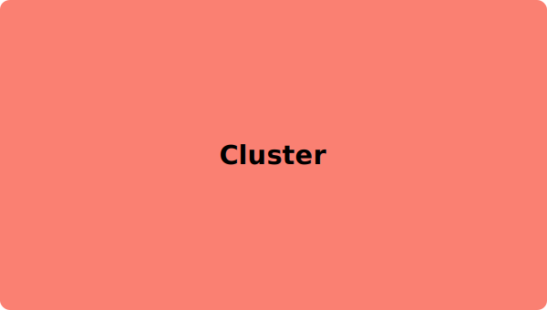
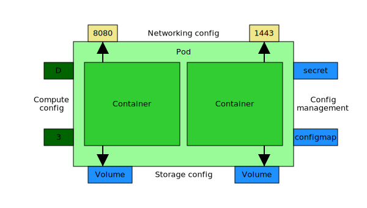
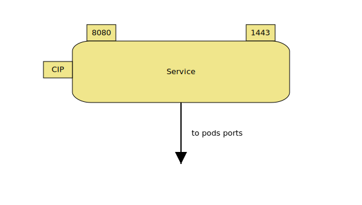
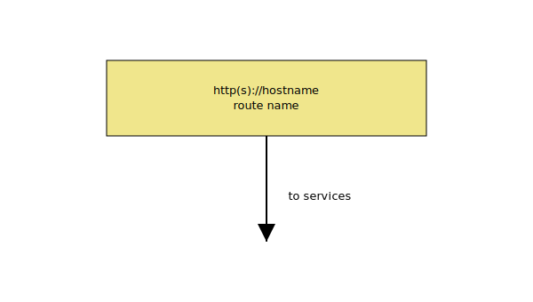
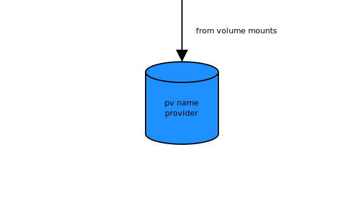

# kdl

KDL (Kubernetes Deployment Language) shapes in SVG

## Background

The KDL was [introduced](https://www.redhat.com/en/blog/kdl-notation-kubernetes-app-deploy) by Raffaele Spazzoli on June 6, 2017. It is a very useful way of describing kubernetes deployments. This repository presents KDL shapes in SVG format suitable for importing into many graphics applications.

### Cluster

### Compute

| Controller | Abbreviation | Configuration |
|------------|--------------|---------------|
| Replica Set | RS | Number or range (e.g.: 3, 2:5) | 
| Deployment | D | Number or range (e.g.: 3, 2:5) | 
| DaemonSet | DS | Node selector (e.g.: storage=true) |
| StatefulSet | SS | Number (e.g.: 3) |
| Job | J | Number (for parallelism) (e.g.: 3) |
| Cron Job | CJ | Number (for parallelism) (e.g.: 3) |

### Networking

#### Service

| Type | Abbreviation |
|------|--------------|
| Cluster IP | CIP |
| Headless (ClusterIP: None) | HS |
| Node Port | NP |
| LoadBalancer | LB |
| External Name | EN |
| External IP | EIP |

#### Ingress

NOTE: For simplicity sake, I am keeping a rectangular shape for ingresses.

### Storage

