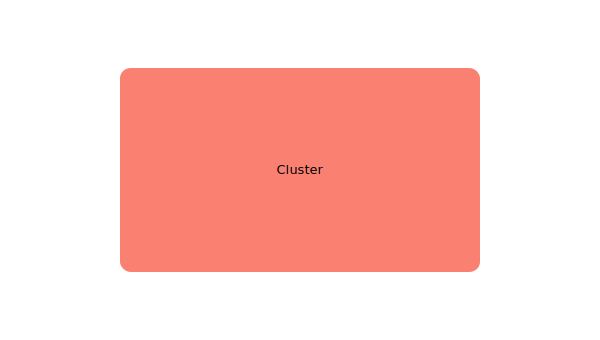

# kdl

KDL (Kubernetes Deployment Language) shapes in SVG

## Background

The KDL was [introduced](https://www.redhat.com/en/blog/kdl-notation-kubernetes-app-deploy) by Raffaele Spazzoli in on June 6, 2017. It is a very useful way of describing kubernetes deployments. This repository presents KDL shapes in SVG format suitable for many applications.

### Cluster

### Compute

